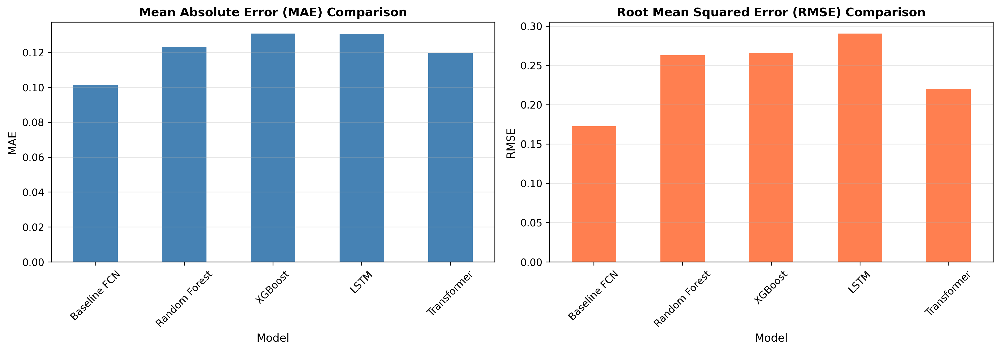

# Forecasting Next-Week Realized Volatility for S&P 500 ETFs

**Team:** Greed and Fear  
**Members:** Vinit S. Bhatt, Siddharthen Sridhar, Ronald Ho, Diogo Viveiros

---

## Project Overview

This project came out of a shared interest in whether realized volatility is actually predictable beyond naive persistence — i.e., does "tomorrow looks like today" hold up against something more sophisticated? We focused on next-week (5-day) realized volatility for a panel of S&P 500-linked ETFs (market, sector, and industry level) using FactSet price data from 2014 to 2025.

One thing we noticed early in EDA is that volatility regimes are sticky — there are long stretches of calm punctuated by sharp spikes (COVID in 2020, rate-hike period in 2022) where the persistence baseline breaks down the most. That motivated us to include macro indicators like VIX, the 10Y/3M yield spread, and oil as features in the more advanced models.

The prediction target is annualized 5-day realized volatility:

$$ y_{i,t} = \sqrt{\sum_{j=1}^{5} r_{i,t+j}^2} \times \sqrt{252} $$

All input features are computed strictly from data available at time $t$ — no look-ahead.

---

## Repository Layout

```
Greed-and-Fear/
├── Code/                   # Main code for the baselines, and the 3 TF models we ran (Elastic Net, LSTM, and Transformer)
├── data/                   # raw dataset and description PDF
├── data_splits/            # pre-split train/val/test CSVs
├── data_with_baselines/    # dataset enriched with 6 heuristic baselines
├── EDA/                    # exploratory analysis notebooks and figures
├── Elastic_Net_Regression/ # Additional code for Elastic Net
├── Transformer_2/          # Additional code using PyTorch used for Ronald's Transformer
├── research_proposal/      # project proposal PDF
├── slides/                 # presentation decks
└── README.md
```

---

## Setup

Python 3.9+ recommended. Install dependencies:

```bash
pip install pandas numpy matplotlib seaborn scikit-learn tensorflow torch xgboost
```

Update the `BASE_DIR` paths in scripts to point to your local `data_splits/` folder before running.

### EDA

```bash
python3 EDA/eda_script.py
```

Saves figures to `EDA/`.

### Model Comparison (all 5 models)

```bash
python3 Code/baseline_model_vs_model_comparison.py
```

Prints results to console and writes `model_comparison_results.csv` and plots to `Code/`.

---

## Models

We started with a dead-simple persistence baseline (predict next week's vol = last 20-day vol) as a sanity check, then added a linear regression in TensorFlow to see if even a 2-feature model beats it. Spoiler: it does, but only modestly. The bigger story is that none of the fancier models beat the linear baseline by much on MAE — which is actually an interesting finding about how efficient the volatility signal is.

| Model | MAE | RMSE |
|---|---|---|
| Baseline FCN (linear) | 0.101 | 0.173 |
| Random Forest | 0.123 | 0.263 |
| XGBoost | 0.131 | 0.265 |
| LSTM | 0.131 | 0.290 |
| Transformer | 0.120 | 0.220 |

The Transformer does close the gap on RMSE vs. the tree models, which makes sense — it handles the tail spike events somewhat better than RF/XGB. The LSTM underperforms, possibly because 5-day sequences are too short to take advantage of recurrence.



---

## What's Left

- Sector/industry subgroup breakdown (does the model work better on low-vol sectors like utilities?)
- Final report writeup and presentation

---

## References

- Campisi, G., et al. (2024). *A comparison of machine learning methods for volatility forecasting.*
- Díaz, J. D., et al. (2024). *Machine-learning stock market volatility: Predictability and profit.*
- Filipović, D., & Khalilzadeh, A. (2021). *Machine learning for predicting stock return volatility.*
